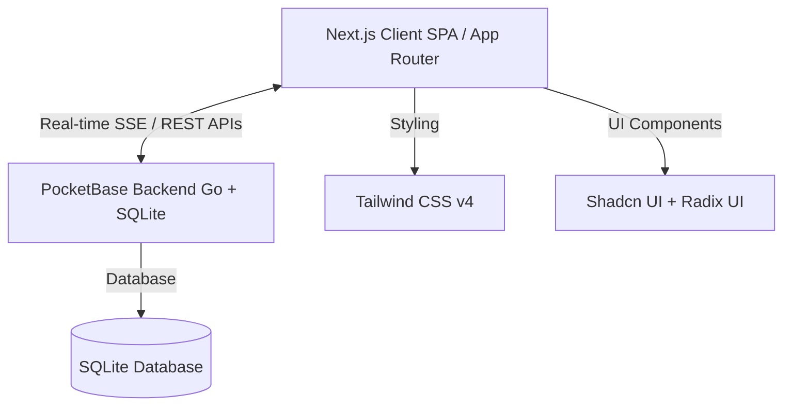
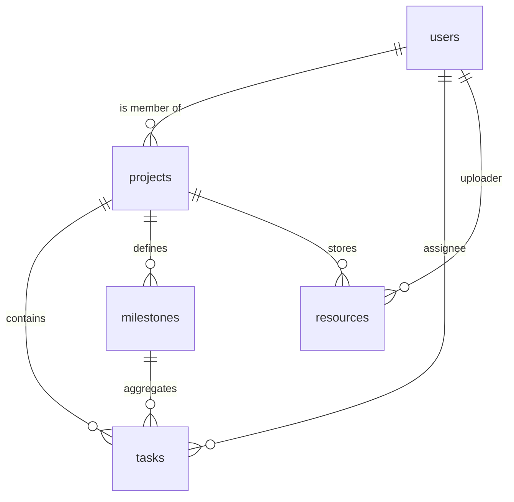

# Planify - Project Management Workspace
## System Analysis & Architecture Report

Planify is a collaborative, real-time project management web application. It is designed to allow teams to manage multiple projects, assign and track tasks via an interactive Kanban board, monitor project milestones with automated progress tracking, and manage external and file resources within a central drive.

---

## 1. Technical Stack Analysis

Planify utilizes a modern, lightweight, and high-performance stack that combines a powerful React framework with a fast, self-contained backend:



### Frontend
*   **Framework:** Next.js (version 16.1.7, using the modern **App Router** paradigm).
*   **Library:** React 19.2.4 (utilizing React Server Components, client-side hooks, and hook-based forms).
*   **Styling:** **Tailwind CSS v4.2.1** featuring dynamic utility classes, system CSS variables, custom themes (Dark Mode), and glassmorphism-inspired UI designs.
*   **State Management & Utilities:**
    *   **PocketBase JavaScript SDK** (`pocketbase`): Used for client-side API requests and real-time WebSocket/SSE subscriptions.
    *   **Lucide React:** Icon set for clean visual cues.
    *   **Date-fns:** For type-safe, human-readable date formatting.
    *   **Sonner:** Lightweight, rich toast notification system.
*   **UI Components:** **Shadcn UI** built over headless **Radix UI** primitives (Dialogs, Tabs, Selects, Dropdowns, Cards, Badges, Avatar).

### Backend & Database
*   **Engine:** **PocketBase** (written in Go) running locally on port `8090`.
*   **Database:** **SQLite**, embedded natively inside PocketBase.
*   **Real-time Capabilities:** Server-Sent Events (SSE) automatically handled by PocketBase to push instant updates on collections (`tasks`, `milestones`, `resources`, `projects`) to all active, subscribed clients.

---

## 2. Database Schema & Relational Design

The application utilizes a highly relational and clean schema set up via PocketBase migrations. The ERD relationship model is defined as follows:



### Collection Schema Descriptions

#### A. `users` (System Collection)
Stores authentication details and user profiles.
*   `id` (Unique Identifier, Primary Key)
*   `email` (String, Unique, Required)
*   `name` (String, Full Name)
*   `avatar` (File, Profile picture attachment)
*   `username` (String, Unique)

#### B. `projects`
Stores top-level project workspaces.
*   `id` (Unique Identifier)
*   `name` (String, Required) - e.g., "Website Redesign"
*   `description` (String, Optional)
*   `target_end_date` (DateTime, Optional) - Target completion deadline
*   `members` (Relation to multiple `users`, Required) - Authorized collaborators

#### C. `milestones`
Tracks major project phases.
*   `id` (Unique Identifier)
*   `project_id` (Relation to `projects`, Cascade Delete) - Links milestone to a project
*   `title` (String, Required) - e.g., "Beta Release"
*   `due_date` (DateTime, Optional)
*   `is_completed` (Boolean, Default: `false`)

#### D. `tasks`
Stores items/tickets to be done, grouped inside Kanban columns.
*   `id` (Unique Identifier)
*   `project_id` (Relation to `projects`, Required) - Parent project
*   `title` (String, Required)
*   `description` (String, Optional)
*   `status` (String, Required) - `todo` | `in_progress` | `done`
*   `order` (Number) - Index to preserve card position on drag & drop
*   `milestone_id` (Relation to `milestones`, Optional) - Linked milestone
*   `assignee_id` (Relation to `users`, Optional) - Member assigned to the task

#### E. `resources`
Assets, deliverables, link sheets, and files for a project workspace.
*   `id` (Unique Identifier)
*   `project_id` (Relation to `projects`, Required)
*   `name` (String, Required) - Display name
*   `type` (String, Required) - `file` | `link`
*   `uploaded_by` (Relation to `users`, Required)
*   `link_url` (String, Optional) - Web URL (if type is `link`)
*   `file_attachment` (File, Optional) - Storage attachment (if type is `file`)

---

## 3. Codebase Structure & Routing Architecture

The codebase follows the standard **Next.js App Router** structure under the `/app` and `/components` directories:

### Root Routing & Flow
```
/ (Root Page)
 └── HomeRedirect component
      ├── Valid Session? -> Push to /dashboard
      └── No Session?    -> Push to /login
```

*   `app/page.tsx` loads the `<HomeRedirect />` component, which checks `pb.authStore.isValid` instantly on the client and performs a seamless client-side redirect to the correct viewport.
*   `app/login/page.tsx` & `app/register/page.tsx` render modern glassmorphic login and registration cards.
*   `app/dashboard/page.tsx` renders the centralized multi-project control deck (`<DashboardClient />`).
*   `app/projects/[project_id]/page.tsx` is a dynamic workspace path. It parses the dynamic parameter `project_id` and forwards it to the massive `<ProjectWorkspaceClient />` workspace panel.

### File Maps
```
├── app/
│   ├── dashboard/           # /dashboard page
│   ├── login/               # /login page
│   ├── register/            # /register page
│   ├── projects/
│   │   └── [project_id]/    # /projects/[id] dynamic page
│   ├── globals.css          # Main styling & Tailwind directives
│   └── layout.tsx           # Providers (Theme, Toast) & standard font setups
├── components/
│   ├── auth/                # LoginForm, RegisterForm components
│   ├── dashboard/           # DashboardClient (multi-project view)
│   ├── home/                # Redirect logic
│   ├── projects/            # Dynamic workspace dashboard client
│   └── ui/                  # Reusable Shadcn primitives
├── lib/
│   ├── pocketbase.ts        # Singleton client configuration for PocketBase
│   └── utils.ts             # Tailwind class merging utility
```

---

## 4. Key Interactive Mechanics

The application contains highly advanced, reactive interactions:

### A. Real-time Synchronization (SSE)
Instead of polling the backend or forcing page refreshes, the app subscribes directly to PocketBase change feeds. Both `dashboard-client.tsx` and `project-workspace-client.tsx` leverage real-time listeners:
```typescript
useEffect(() => {
  // Subscribe to real-time events on tasks, milestones, and resources
  pb.collection('tasks').subscribe('*', () => loadTasks());
  pb.collection('milestones').subscribe('*', () => loadMilestones());
  pb.collection('resources').subscribe('*', () => loadResources());

  return () => {
    pb.collection('tasks').unsubscribe('*');
    pb.collection('milestones').unsubscribe('*');
    pb.collection('resources').unsubscribe('*');
  };
}, [projectId]);
```
Whenever a user adds, modifies, deletes, or moves a task, **all other connected users see the update in real-time** without reloading the page.

### B. Drag-and-Drop Kanban Board
The Kanban board implements raw HTML5 Drag & Drop API (`draggable`, `onDragStart`, `onDragOver`, `onDrop`).
*   **Dynamic Order Control:** When dropping a task, the order is updated dynamically by calculating the max index within the targeted column.
*   **Instant Optimistic UI Updates:** State is updated instantly on drop to ensure zero-lag drag responsiveness, while API calls run in the background to persist changes across all clients.

### C. Calculated Milestone Progress
Milestone progress is computed dynamically. Tasks belong to a milestone via the `milestone_id` relation. The milestone component dynamically calculates completion percentage:
$$\text{Progress \%} = \left( \frac{\text{Completed Tasks}}{\text{Total Tasks linked to Milestone}} \right) \times 100$$
This is visualized using a smooth CSS-transition animated progress bar.

---

## 5. Security & Access Control Model

Planify uses PocketBase **API Rules** to secure the workspace directly at the database layer:
*   **Authenticity Enforcement:** Endpoints and collection actions are locked only to authenticated accounts (`@request.auth.id != ""`).
*   **Role-Based Collaborations:** A project is locked to its members. The API rule:
    ```
    project_id.members ?= @request.auth.id
    ```
    ensures that a user can only query, read, create, or modify tasks, milestones, and resources linked to a project where they are listed in the `members` array.
*   **Workspace Member Invitation:** Project owners can search users by email and dynamically add their IDs (`members+` operator) to invite them to collaborate.

---

## 6. Recommendations & Improvements

The application is exceptionally solid, beautiful, and fully functional. To scale it to a enterprise-grade SaaS platform, the following improvements are recommended:

1.  **Transition to an Advanced Drag & Drop Library:**
    *   *Issue:* Standard HTML5 drag-and-drop can feel rigid on mobile and lacks smooth layout-shift animations.
    *   *Action:* Integrate `@hello-pangea/dnd` (formerly `react-beautiful-dnd`) or `@dnd-kit/core` for premium physics-based animations, keyboard accessibility, and native touch support.
2.  **Add Rich-Text Support for Task Descriptions:**
    *   *Issue:* Currently, task descriptions are plain text inputs.
    *   *Action:* Embed a lightweight markdown editor (like `MDXEditor` or a TipTap primitive) to allow tables, checklist formatting, and code snippets in task details.
3.  **Visual Analytics & Charts:**
    *   *Issue:* Milestones are tracked individually, but there's no high-level project trajectory view.
    *   *Action:* Integrate a simple Gantt Chart or a Burndown chart component using `recharts` to map task completion timelines.
4.  **Activity Feed & Audit Log:**
    *   *Issue:* In a collaborative project, it's hard to track who modified what.
    *   *Action:* Create an `activity_log` collection in PocketBase. Write logs on actions (e.g., "John Doe moved Task X to In Progress") to display a dynamic history feed in the workspace.
5.  **Multi-File Uploads and S3 Storage:**
    *   *Issue:* Large local file uploads can deplete local SQLite hosting space.
    *   *Action:* Configure PocketBase to sync directly with AWS S3 or Cloudflare R2 for storing resources and project attachments securely.
